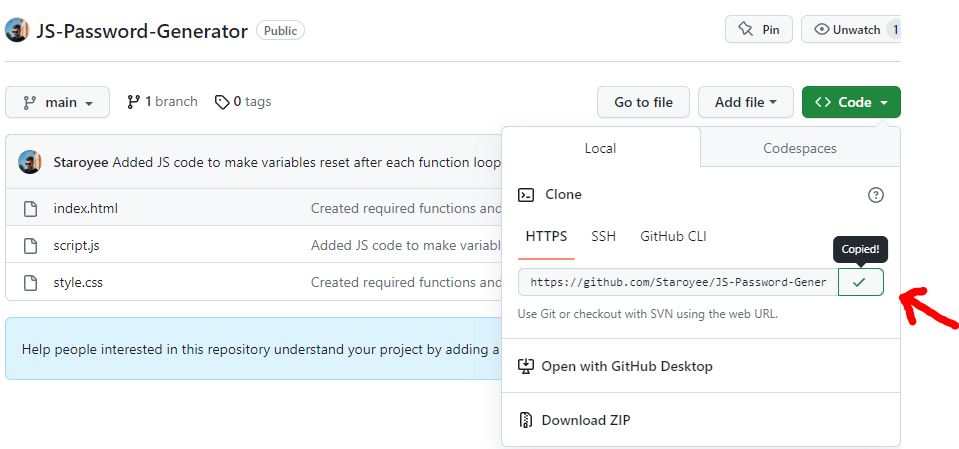
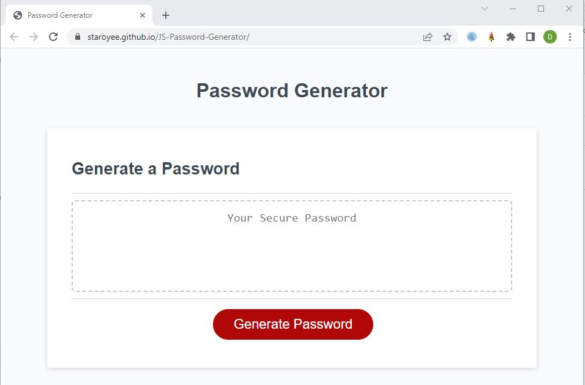
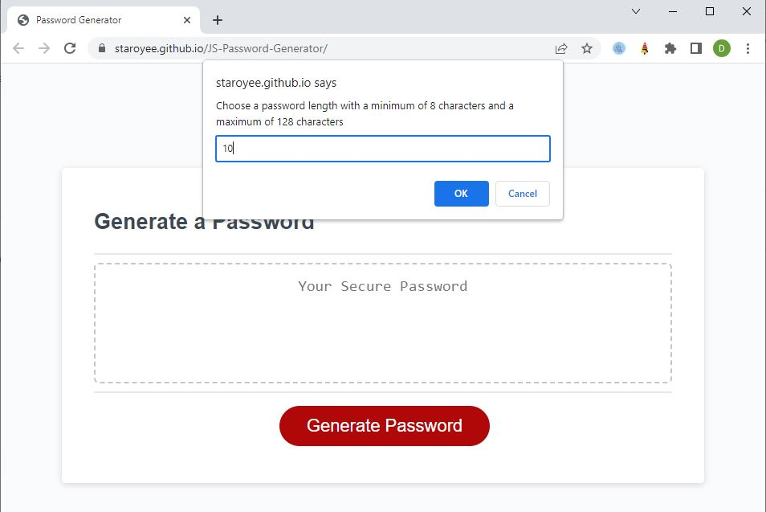
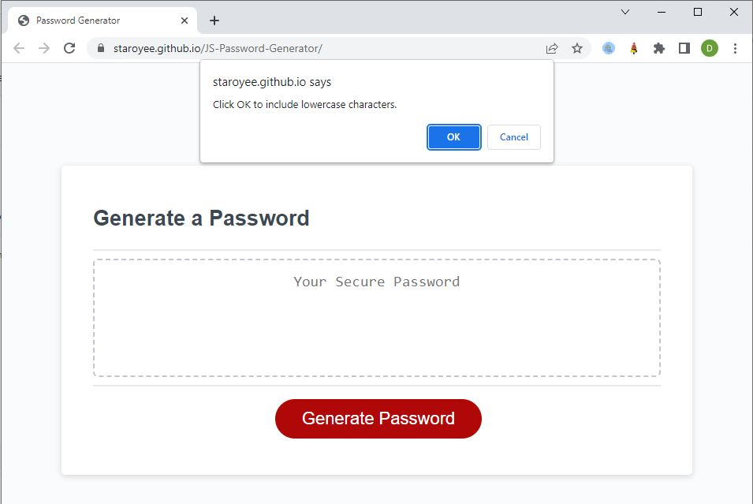
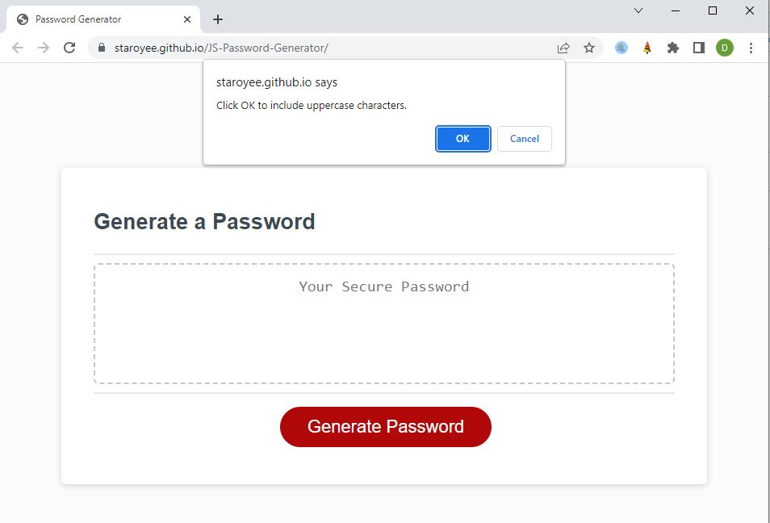
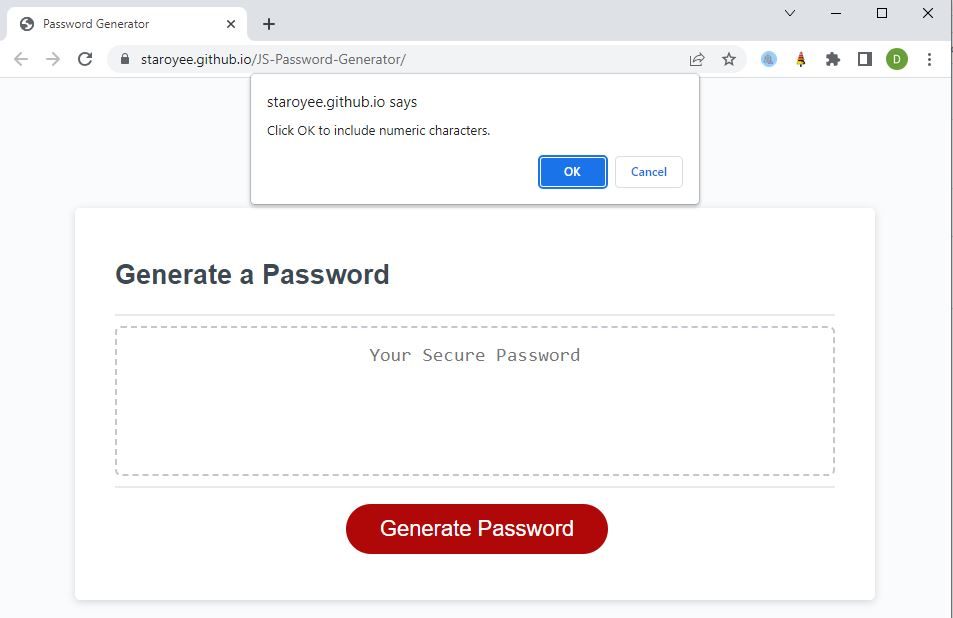
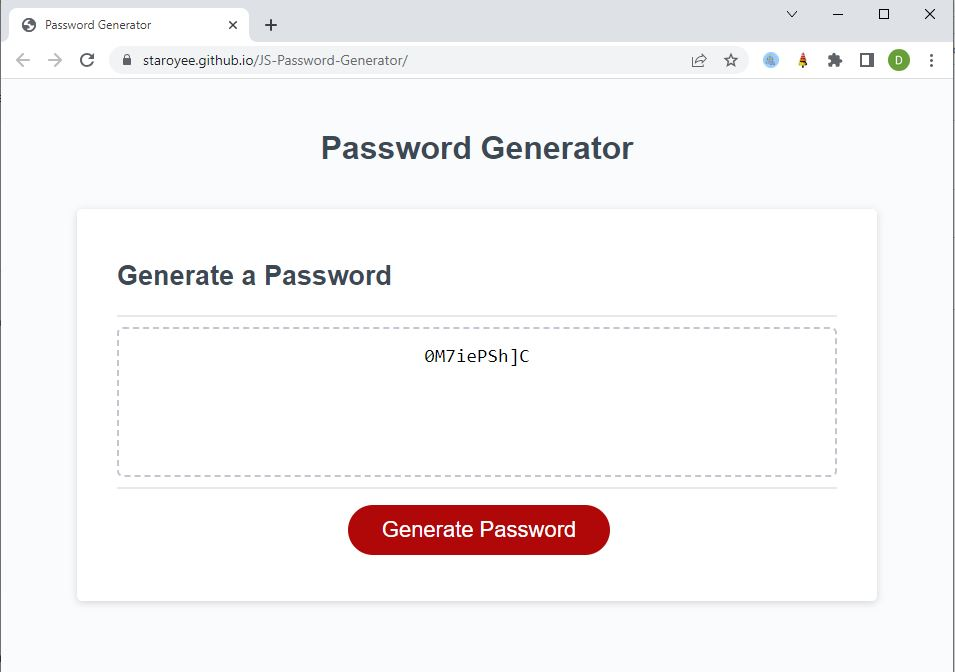

# Daniel-Portfolio

## Description
I was tasked write and add JavaScript code to an existing HTML file so that it would randomly generate a password with the input selections from a user.

I was motivated to undertake this task because I wished to gain a greater understanding of JavaScript and how it interacts with existing HMTL and CSS files.

## Solve
The completion of this code solves the problem of a user not being able to use the website to randomly generate a password with a users input.

The webpage is now deployed for use.

## I have learned:
* How to use "for loops"  to return a strings values and incorporating Math.floor and Math.random to apply randomness.
* How to link JavaScript sheets to a HTML page.
* How to randomly select a single value from a string variable.
* How to use "if" statements to collect data from user inputs.
* How to create and what the differences are between "Prompts, confirms, and alerts".
* How to create a function and to call it to execute within another function.
* How to use methods such as "addEventListener" (to listen for an event to trigger an activation of a function) and "querySelector"s (to select an element using an id (#) or class (.) from within an HTML document and apply it's value to a variable within JavaScript)

## Installation
Steps to install this project on your local PC
1. Open the termal on your machine.
2. Use the terminal command `cd` to navigate to the directory where we want the repository located.
3. Locate the 'Code' button on the 'JS-Password-Generator' github repository, click it, then copy the 'HTTPS' link to clipboard. (See image)

4. Use the git command `git clone` followed by the URL copied from Github to clone the repo to our machine.
5. The `git clone` command creates a new directory with the same name as the repository. We navigate into our new directory using `cd`.
6. The repository should now be cloned onto your device and able to be edited in VScode or another editing software.

## Instructions

To use the site:
1. Click the "Generate Password" button.
2. Select "Ok" or "Cancel" to confirm how many and which characters to include in your random password.
3. The password will be generated for use.
4. If no data was selected it will give you a prompt to restart the selections.

## Deployed Application Link
* https://staroyee.github.io/JS-Password-Generator/

## Screenshot

## Credits
* https://developer.mozilla.org/en-US/docs/Web/Events/Creating_and_triggering_events
* https://developer.mozilla.org/en-US/docs/Web/API/EventTarget/addEventListener
* https://www.w3schools.com/js/js_if_else.asp
* https://developer.mozilla.org/en-US/docs/Web/JavaScript/Reference/Global_Objects/String/charAt
* https://developer.mozilla.org/en-US/docs/Web/JavaScript/Reference/Statements/return
* https://developer.mozilla.org/en-US/docs/Learn/JavaScript/First_steps/Variables
* https://developer.mozilla.org/en-US/docs/Web/JavaScript/Data_structures
* https://developer.mozilla.org/en-US/docs/Web/JavaScript/Reference/Global_Objects/Array
* https://developer.mozilla.org/en-US/docs/Web/JavaScript/Reference/Statements/for
* https://developer.mozilla.org/en-US/docs/Web/JavaScript/Guide/Functions
* https://developer.mozilla.org/en-US/docs/Glossary/Scope
* https://developer.mozilla.org/en-US/docs/Web/JavaScript/Guide
* https://developer.mozilla.org/en-US/docs/Web/JavaScript/Guide/Working_with_Objects
* https://www.w3schools.com/js/js_loop_for.asp
* https://stackoverflow.com/questions/41206642/javascript-math-random-in-a-for-loop
* https://developer.mozilla.org/en-US/docs/Web/JavaScript/Reference/Global_Objects/Math/random

